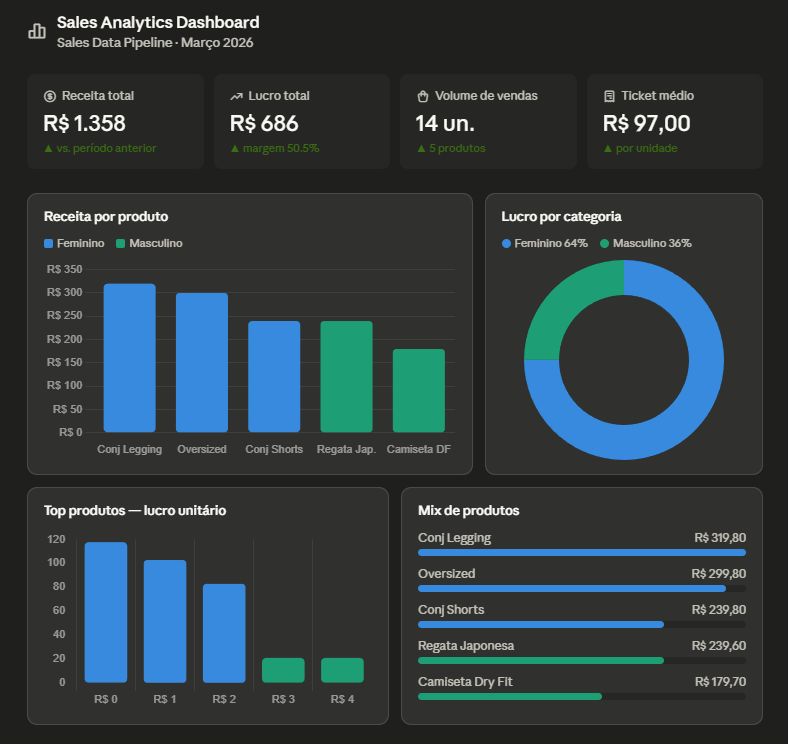

# 🚀 End-to-End Sales Data Pipeline for Analytics


---

## 🎯 Business Context

This project reflects real-world data engineering challenges, including data quality, reproducibility, and scalable pipeline design.

The goal is to enable:

- Sales performance monitoring
- Product-level analysis
- Data-driven decision making
- A centralized and reliable data source (Single Source of Truth)

---

## 💡 Key Highlights

- End-to-end data pipeline (ingestion → transformation → visualization)
- Designed with scalability and reproducibility in mind
- Strong focus on data quality and consistency
- Built using modern data engineering practices

---

## 🧠 Data Governance Considerations

- Ensures consistency across multiple data sources
- Supports a Single Source of Truth approach
- Prepares the foundation for Master Data Management (MDM)
- Improves data reliability for business decision-making

---

## 🏗️ Data Architecture

The pipeline follows a layered architecture:

- **Raw Layer**: Source Excel/CSV files
- **Staging Layer**: Initial cleaned data
- **Curated Layer**: Structured tables in PostgreSQL
- **Analytics Layer**: Power BI dashboards

---

## 🔄 Pipeline Stages

| Stage          | Description                                  | Technology      |
|----------------|----------------------------------------------|-----------------|
| Extraction     | Reading data from Excel/CSV source files     | Python, Pandas  |
| Transformation | Cleaning and processing data                 | Python, Pandas  |
| Loading        | Inserting structured data into PostgreSQL    | PostgreSQL      |
| Visualization  | Interactive dashboards for business insights | Power BI        |

---

## 📊 Dashboard Preview




---

## ⚙️ Pipeline Features

- Data ingestion from heterogeneous sources
- Data cleaning and standardization
- Idempotent load process
- Environment-based configuration
- Containerized execution
- Modular ETL design
- Reproducible local environment using Docker

---

## 🛠️ Tech Stack

| Layer           | Technology                          |
|-----------------|-------------------------------------|
| Language        | Python 3.8+                         |
| Database        | PostgreSQL 15                       |
| Containerization| Docker & Docker Compose             |
| BI Tool         | Microsoft Power BI                  |
| Libraries       | pandas, psycopg2, openpyxl, python-dotenv |

---

## 🧩 Data Model

The database follows a simplified analytical model:

- **produtos**: product-level information (cod, tipo, qtde, modelo, tamanho, custo_unit, venda_unit, lucro_unit, custo_total, venda_total, lucro_total, data_entrada, data_saida)

Future improvements include evolving the model into a Star Schema:

```
fact_sales
├── dim_products
├── dim_date
└── dim_category
```

This structure allows efficient querying and supports BI tools at scale.

---

## ✅ Data Quality Checks

- Null value handling
- Data type validation
- Duplicate removal
- Schema enforcement before loading

---

## 📊 Business Insights (Power BI)

The dashboard provides:

- Revenue trends over time
- Top-performing products
- Sales distribution by category (Feminino / Masculino)
- Key KPIs: total revenue, total profit, average ticket, sales volume

---

## 📂 Project Structure

```
project-data-engineering-portfolio/
├── dashboard/             # Dashboard preview image and HTML
│   ├── Dashboard.png
│   └── sales_dashboard_preview.html
├── data/                  # Source files (Excel/CSV)
│   └── produtos.xlsx
├── docker/                # Docker container configurations
│   └── docker-compose.yml
├── etl/                   # Python scripts for Extraction & Loading
│   └── load_products.py
├── sql/                   # SQL scripts for table creation
│   └── create_tables.sql
├── requirements.txt       # Python dependencies
├── .gitignore
└── README.md
```

---

## 🚀 Getting Started

### 1. Prerequisites

- Docker and Docker Compose
- Python 3.8+
- Power BI Desktop (optional for visualization)

### 2. Environment Configuration

1. Rename `.env.example` to `.env` in both `docker/` and root directories
2. Fill in your credentials

### 3. Spin Up Database

```bash
cd docker
docker-compose up -d
docker ps
```

### 4. Run the ETL Pipeline

```bash
pip install -r requirements.txt
python etl/load_produtos.py
```

### 5. Visualize in Power BI

1. Open the `.pbix` file in `dashboard/`
2. Go to **Home → Transform Data → Data source settings**
3. Update the connection to your local PostgreSQL instance
4. Click **Refresh**

---

## 🔐 Security Best Practices

| Practice           | Implementation                                |
|--------------------|-----------------------------------------------|
| Secrets Management | Credentials managed via environment variables |
| Version Control    | Sensitive files ignored via `.gitignore`      |
| Database Access    | Non-root user with restricted permissions     |
| Network Security   | PostgreSQL exposed only to localhost          |

---

## 🧪 Testing & Validation

```bash
# Access PostgreSQL container
docker exec -it postgres-bi psql -U $POSTGRES_USER -d $POSTGRES_DB

# Validate data insertion
SELECT COUNT(*) FROM produtos;
SELECT * FROM produtos LIMIT 10;
```

---

## 🚀 Future Improvements

- [ ] Incremental data loading
- [ ] Star Schema modeling (fact_sales, dim_products, dim_date)
- [ ] Workflow orchestration with Apache Airflow
- [ ] Data quality monitoring with Great Expectations
- [ ] Cloud deployment (Azure / AWS)

---

## 👤 About

Built by **Bruno Nogueira** — Data Engineer with 13+ years in infrastructure and cloud environments (Azure, OCI), transitioning into data engineering and analytics. This project demonstrates real-world ETL design applied to retail business data.

[](https://linkedin.com/in/bruno-nogueira-4aa686a3)
[](https://github.com/brunonog182)
[](mailto:brunogueira182@protonmail.com)
